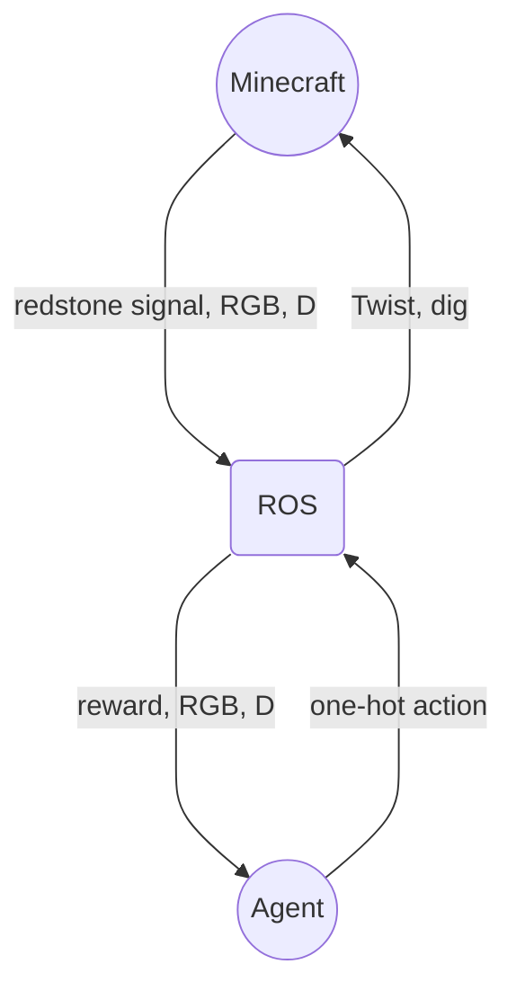

# Minecraft ROS Reinforcement Learning Agent
This repo introduces three executable ROS nodes: the Rewarder, StateFormer, and Teleop nodes. These nodes are instantiated automatically by the algorithm to train a policy, but can be run individually for debugging.


## Installation:

```
# clone this repo
git clone https://github.com/ogoudey/Minecraft-Agent.git
```
Next get the minecraft-ROS mod. The following fork of the original is bug-free and suffices.
```
cd Minecraft-Agent
git clone https://github.com/ogoudey/minecraft_ros2
```
Now start up the container.
```
cd minecraft_ros2
sudo xhost +local:root         # for GUI permissions for docker
sudo docker compose up         # build the container
```
Once the container is up, in another terminal:
```
cd Minecraft-Agent
./copy_scripts.sh         # puts custom code in the container
./bash.sh                 # shortcut for entering the running container
. quickstart.sh           # sources all the ROS workspaces, makes Python venv and moves cwd to the custom ROS workspace
```

# Running
## Testing performance
1. Start Minecraft (if container isn't already up):
```
cd minecraft_ros2
sudo xhost +local:root
sudo docker compose up
```
Then open up a Minecraft world.

2. In another terminal:
```
cd Minecraft
./bash.sh
. quick_start.sh
```
3. With the container's environments sourced, run a testing script.
```
ros2 run agent keys
```
Make sure the black popup window is in focus. WASD+space to move, arrow keys to orient, and B to dig.

## Reinforcement Learning

### Grassy Superflat
Currently only one training environment is supported.

After `. quick_start.sh`, run:
```
python3 src/agent/agent/policy_performer.py --i 100         # Trains for 100 iterations.
```

#### How it works
Policy evaluation comes from the following redstone device, which senses if particular blocks are broken:




For a tree at 0 -60 4, the Minecraft command block has the line:
```
execute if block 0 -60 4 minecraft:oak_log if block 0 -59 4 minecraft:oak_log if block 0 -58 4 minecraft:oak_log if block 0 -57 4 minecraft:oak_log
```

ROS subscribes to that particular command block by setting a redstone pub_sub block to publish from within Minecraft:
```
/data merge block -3 -60 16 {CustomName:"redstone/my_block",pollRate:10}
```
where the coordinates are of the `minecraft_ros2:redstone_pub_sub` block in the device above. (The ROS node Rewarder subscribes to `/redstone/my_block/output` so "my_block" is important.)

### Extras
Hit F3 + P to enable/disable pause on lost focus.
Hide the chat in settings.

## File structure
(Will turn this into a CLI soon)
### extract_scripts
#### extract_graph.sh
Brings a specified plot (any plots automatically saved in the container's workspace root) to the project root.
#### extract_policy.sh
Brings a specified policy to the `/figures`. These policies are later loaded by the `--checkpoint` argument.
#### save_world.sh
Saves the Minecraft save folder to `/world_saves`. 

### world_saves
Folder of all saved Minecraft worlds
#### load_saved_world.sh
Puts the saved world into the container's Minecraft saved worlds folder, to be opened from the Minecraft GUI.

## Contributing
To push changes to the algorithm, performance, or reward system:

1. Edit the files on host machine
2. Run ./copy_scripts.sh
3. From inside the container rebuild `custom_ws`: `colcon build && . install/setup.bash`
