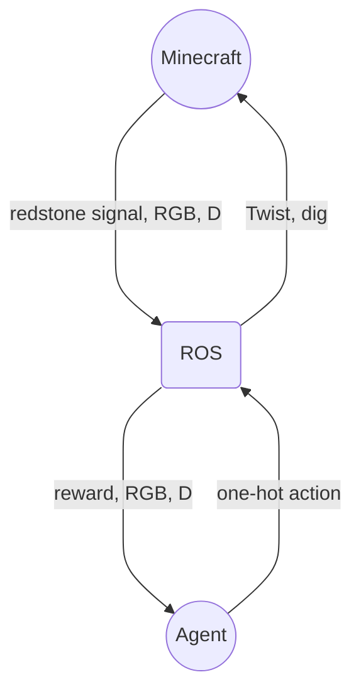

# Minecraft ROS Reinforcement Learning Agent
This repo introduces three executable ROS nodes: the Rewarder, StateFormer, and Teleop nodes. These nodes are instantiated automatically by the algorithm to train a policy, but can be run individually for debugging.


## Usual setup:

```
# clone this repo
git clone https://github.com/ogoudey/Minecraft-Agent.git

cd Minecraft-Agent

# clone the minecraft_ros2 repo
git clone https://github.com/minecraft-ros2/minecraft_ros2.git

cd minecraft_ros2
xhost +local:root         # for GUI permissions for docker
docker compose up         # build the container

# in another terminal
./bash.sh                 # shortcut for entering the running container

# source all overlays (including ros2_java_ws)

```
### Note:
If you get an error relating to the GPU (or non-existence of one on the host machine), delete the `deploy.resources.reservations.devices` block in the `compose.yaml`.

## Custom Setup


### New ROS Nodes and Agent
Now, get the custom ROS workspace in there. On the host machine, run:
```
./copy_scripts.sh      # shortcut for 'docker cp ...'
```

Make sure the container's up and running (`docker compose up`), and enter it with:
```
./bash.sh
```

Now in the container, do:
```
apt update
apt install python3.10-venv
cd ../custom        # this is the custom, copied directory
python3 -m venv .venv
. .venv/bin/activate
pip install pygame numpy torch pyyaml cv_bridge opencv-python matplotlib    # and all future libs to be used
```

The files will be moved into the container in the right spot. Now build the custom workspace from back inside the container:
```
cd custom/custom_ws
colcon build
. install/setup.bash
```

Also source `/ws/ros2_java_ws` and the underlay `/opt/...`.

Now ready to run.



# Running
## Teleop, StateFormer, and Rewarder
1. Start Minecraft (`docker compose up`) and open up a world.
2. In another terminal:
```
./bash.sh # now you're in the container
. custom/custom_ws/install/setup.bash       # agent nodes now available
ros2 run agent keys                         # or 'state_former' or 'rewarder'
```
Make sure the black popup window is in focus. WASD+space to move, arrow keys to orient, and B to dig.

## Reinforcement Learning

### Grassy Superflat
1. Open up the superflat grass_block world in Minecraft.

2. Make the oak tree at 0 -60 4

3. Add the following redstone device, and point it to the tree:


That is, for a tree at 0 -60 4, write in the Minecraft command block the line:
```
execute if block 0 -60 4 minecraft:oak_log if block 0 -59 4 minecraft:oak_log if block 0 -58 4 minecraft:oak_log if block 0 -57 4 minecraft:oak_log
```
and that's a _repeating, always active_ command block. (Pay attention to the directionality of the command block.)

4. Then link up ROS to _that particular command block_. In Minecraft chat, say
```
/data merge block -3 -60 16 {CustomName:"redstone/my_block",pollRate:10}
```
where the coordinates are of the `minecraft_ros2:redstone_pub_sub` block in the device above. (The ROS node Rewarder subscribes to `/redstone/my_block/output` so "my_block" is important.)

5. source all ROS workspaces and the virtual environment created in Custom Setup

6. In `/ws/custom/custom_ws/`, run:
```
python3 src/agent/agent/policy_performer.py (--checkpoint /ws/custom/checkpoints/best.pth (--test))
```
